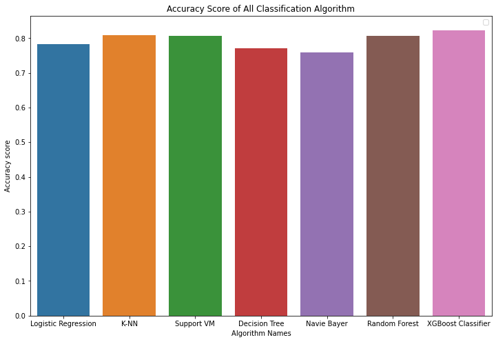

# Salary Price Prediction

## Description
Salary Price Prediction is a Python-based machine learning project aimed at predicting salaries based on various features. This project involves data cleaning, data visualization, model building, and performance evaluation using machine learning algorithms. 

The primary goal is to develop a predictive model that accurately estimates salaries based on input features. After thorough exploration and analysis, the project achieved 82.20% accuracy using the XGBoost Classifier algorithm.

## Technologies Used
- Python
- Machine Learning
- XGBoost
- Data Cleaning
- Data Visualization
- Model Building

## Usage
1. **Data Cleaning**: The dataset is cleaned to remove irrelevant or redundant features, ensuring that only essential data is used for training the model.
2. **Exploratory Data Analysis (EDA)**: Through EDA, insights are gained into the dataset, such as the distribution of occupations and other relevant factors influencing salary prediction.
3. **Model Building**: Various machine learning algorithms are implemented to build predictive models.
4. **Performance Evaluation**: The performance of each model is evaluated, and the accuracy scores are compared to identify the most effective algorithm for salary prediction.

## Accuracy of Classification Algorithms
- Logistic Regression: 78.29%
- K-Nearest Neighbors: 80.78%
- Support Vector Machine: 80.64%
- Decision Tree: 77.14%
- Naive Bayes: 75.96%
- Random Forest: 80.68%
- XGBoost Classifier: 82.31% (Highest)

## Correct and Incorrect Input Data
For detailed analysis of correct and incorrect input data for each algorithm, refer to the code or documentation.

## Accuracy Comparison Plot

## How It Helps
- **Predictive Insights**: Provides insights into salary prediction based on various factors, aiding individuals or organizations in making informed decisions.
- **Efficiency**: By automating the salary prediction process, it saves time and resources compared to manual analysis.
- **Customization**: Users can customize the model based on their specific requirements and datasets.
- **Continuous Improvement**: The project can be further enhanced by incorporating additional features or refining existing algorithms to improve prediction accuracy.

## Getting Started
1. Clone this repository.
2. Install the necessary libraries mentioned in the `requirements.txt`.
3. Run the provided Python script or Jupyter Notebook to explore the dataset, build models, and evaluate their performance.

## License
This project is licensed under the [MIT License](LICENSE).
